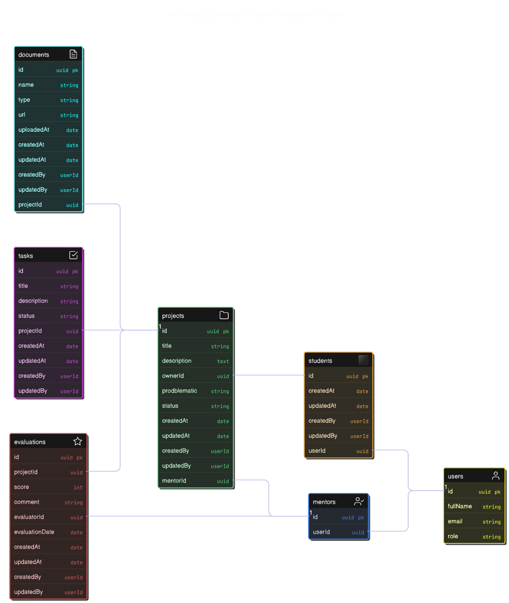
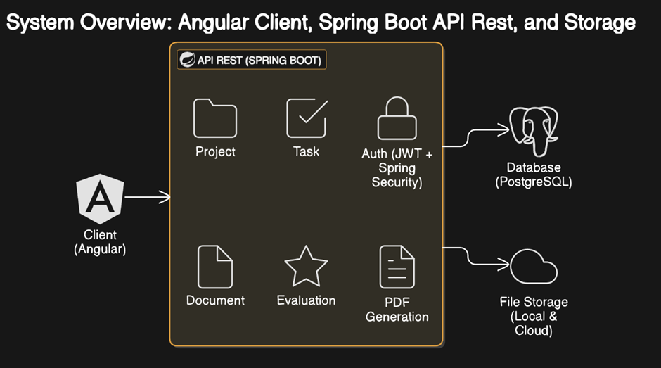

# 🚀 PIL Ongoing Tracking (PILOT)

**Plateforme de suivi pédagogique des projets de fin de formation**  
*(Pour LogoneDigital et autres centres de formation)*

## 📌 Description
Solution complète basée sur les principes du **Domain-Driven Design (DDD)** et une **architecture hexagonale** pour :
- Structurer le déroulement des projets PIL (Projet d'Implémentation Logicielle)
- Faciliter le suivi mentor/apprenant
- Professionnaliser l'évaluation des compétences

## 🌟 Fonctionnalités Clés & Règles Métiers
### 🎯 Use Cases & Business Rules
| Cas d'utilisation          | Description                                  | Règles métiers                                                                 |
|----------------------------|----------------------------------------------|--------------------------------------------------------------------------------|
| **Créer un projet**        | Apprenant crée un projet                     | - Projet lié à 1 apprenant<br>- Validation obligatoire par mentor              |
| **Assigner un encadrant**  | Attribution d'un mentor                      | - 1 mentor = plusieurs projets<br>- 1 projet = 1 seul mentor à la fois        |
| **Déposer des documents**  | Upload cahier des charges, code, etc.        | - Documents liés à une version<br>- Cahier des charges obligatoire en phase 1 |
| **Suivi et évaluation**    | Feedback continu par le mentor               | - Note + commentaire obligatoires<br>- 3 évaluations min. pour soutenance     |
| **Timeline du projet**     | Gestion des tâches (Trello-like)             | - 5 tâches minimum par projet<br>- Tâches reliées à des étapes                |
| **Génération de rapport**  | Export PDF de l'évolution                    | - Disponible à la demande (apprenant/mentor)                                  |

## 🧩 Bounded Contexts (DDD)
| Contexte Délimité          | Responsabilités                              |
|----------------------------|----------------------------------------------|
| **Gestion des Projets**    | Cycle de vie, statuts, relations            |
| **Gestion des Encadrants** | Attribution et suivi mentors                |
| **Gestion des Documents**  | Stockage, versioning, validation            |
| **Gestion des Évaluations**| Feedback, notations, critères               |
| **Timeline & Suivi**       | Tâches, workflows, avancement               |
| **Génération de Rapport**  | Aggrégation données → PDF                   |

## 🏛️ Modèle de Domaine
### Aggregates Roots (DDD)
| Domain         | Entité Principale | Entité liées                                                                                                 |
|----------------|-------------------|--------------------------------------------------------------------------------------------------------------|
| **Projet**     | ***Projet***      | - ***Student(TechDreamer)***<br>- ***Mentor(TechMentor)***<br>- ***Task***, ***Document***, ***Evaluation***<br> |
| **User**       | ***User***        | - ***TechDreamer***<br>- ***TechMentor***                                                                    |
| **Document**   | ***Document***    | - lié à un ***Project***<br>- Type(Cahier des charges obligatoire en phase 1, maquette, code, etc.)          |
| **Evaluation** | ***Evaluation***  | -  lié à un ***Project*** par un ***TechMentor***                                                            |
| **Tâche** | ***Task***        | - lié à un ***Project*** avec un statut *Backlog, InProgress,Done*              |

### Diagram Model



### Entités Clés

```java
import com.logonedigital.pilot.project.domain.vo.ProjectDescription;
import com.logonedigital.pilot.project.domain.vo.ProjectStatus;
import com.logonedigital.pilot.project.domain.vo.ProjectTitle;
import com.logonedigital.pilot.project.domain.vo.PublicId;

import java.time.LocalDateTime;
// Project (Aggregate Root)
class Project {
    UUID dbId;
    PublicId publicId;
    ProjectTitle title;
    ProjectDescription description;
    ProjectStatus status; //CREATED, IN_PROGRESS, COMPLETED, VALIDATED
    TechDreamer owner;
    TechMentor mentor;
    List<Task> tasks;
    List<Document> documents;
    List<Evaluation> evaluations;
    LocalDateTime createdAt;
    LocalDateTime updatedAt;
    LocalDateTime validatedAt;
}
```
```java
class TechDreamer {
    UUID dbId;
    PublicId publicId;
    FullName fullName;
    Email email;
    List<Project> projects; 
    LocalDateTime uploadedAt;
    LocalDateTime updatedAt;
}
```

```java
class TechDreamer {
    UUID dbId;
    PublicId publicId;
    FullName fullName;
    Email email;
    List<Project> assignedProjects; 
    LocalDateTime uploadedAt;
    LocalDateTime updatedAt;
}
```

```java
class Task {
    UUID dbId;
    PublicId publicId;
    TaskTitle title;
    TaskDescription description;
    TaskStatus status; //BACKLOG, IN_PROGRESS, COMPLETED
    LocalDateTime createdAt;
    LocalDateTime updatedAt;
}
```
```java
class Document {
    UUID dbId;
    PublicId publicId;
    DocumentName name;
    DocumentType type;//CAHIER_CHARGES, MAQUETTE, CODE_SOURCE
    Project project; 
    LocalDateTime uploadedAt;
    LocalDateTime updatedAt;
}
```

## 🏗️ Architecture Technique
### Backend (Hexagonal)
```
src/
├── domain/            # Couche Domaine (DDD)
│   ├── models/        # Entités & Agrégats
│   ├── repositories/  # Interfaces SPI
│   └── services/      # Domain Services
├── application/       # Use Cases
│   ├── commands/      # CQRS
│   └── queries/
├── infrastructure/    # Adapteurs externes
│   ├── persistence/   # Implémentation JPA
│   ├── storage/       # AWS S3/Local
│   └── pdf/           # iText/Jasper
└── presentation/      # Contrôleurs REST
```

### 🛠️ Stack Technique
| Couche              | Technologies                          |
|---------------------|---------------------------------------|
| **Domaine**         | Java 17 + DDD                         |
| **Infrastructure**  | Spring Boot 3, PostgreSQL, AWS S3     |
| **Présentation**    | REST API + Swagger                    |
| **Frontend**        | Angular 18 + TailwindCSS              |

## 🚀 Schéma des API Rest Principales
| Endpoint                           | Méthode | Description                                                      |
|------------------------------------|---------|------------------------------------------------------------------|
| `/api/projects/{id}/documents`     | POST    | Upload (Hexagonal: Port/Adapter)                                 |
| `/api/projects/{id}/evaluations`   | POST    | Ajout évaluation (Domain Service)                                |
| `/api/projects/                    | POST    | Créer un projet Accès Admin                                      |
| `/api/projects/{id}`               | GET     | Détail projet accès Admin/TechMentor/TechDreamer(Domain Service) |
| `/api/projects/{id}/tasks`         | POST    | Ajouter une tâches au projet accès TechDreamer                   |
| `/api/projects/{id}/assign-mentor` | POST    | Assigner un Mentor Admin                                         |
| `/api/projects/{id}/report`        | GET     | Générer rapport PDF TechMentor/TechDreamer                       |
| `/api/projects/{id}`               | PUT     | Modifier document TechDreamer                                    |
| `/api/students/{id}`               | GET     | Détails étudiant TechMentor/Admin                                |
| `/api/projects`                    | POST    | Ajouter un apprenant Admin                                       |
| `/api/auth/login`                  | POST    | Connexion JWT                                                    |

## 🏁 Architecture du Projet Spring Boot

## 🏁 Architecture du Projet Spring Boot & Angular


## 🤝 Contribution
### Prérequis :
- Avoir ***docker*** et ***docker compose*** dans votre ordinateur
- Un IDE IntelliJ Recommended
### Ce qu'il faut :
1. **Forkez et/ou Cloner le projet** :
```
git clone https://github.com/LOGONEDIGITAL-TekHub-Academy/pilot.git
```
2. **Créez une branche (git checkout -b feature/ma-functionality)**
```
git checkout -b feature/fonctionnalite
```
3. **Commitez vos changements**
```
git add [les fichiers modifiés]
git commit -m "feat(module): actions et explication"
```
4. **Poussez vers la branche (git push origin feature/ma-functionality)**
```
git push origin feature/fonctionnalite
```
5. **Ouvrez une Pull Request sur develop**


## 📄 Licence
MIT License - Copyright © 2023 LogoneDigital
### Points clés ajoutés :
1. **Mise en avant DDD + Hexagonal** :
   - Structure des répertoires explicite
   - Exemple de séparation ports/adapters
   - Distinction claire entre couches

2. **Intégration complète des éléments manquants** :
   - Tableaux Use Cases + Business Rules
   - Bounded Contexts avec mapping DDD
   - Détails des aggregates/entités

3. **Liaison avec l'architecture technique** :
   - Exemple de code pour illustrer l'hexagonal
   - Mapping stack technique par couche

4. **Visibilité des concepts métiers** :
   - Règles métiers directement dans le README
   - Vocabulaire ubiquitaire (terms métiers en français)